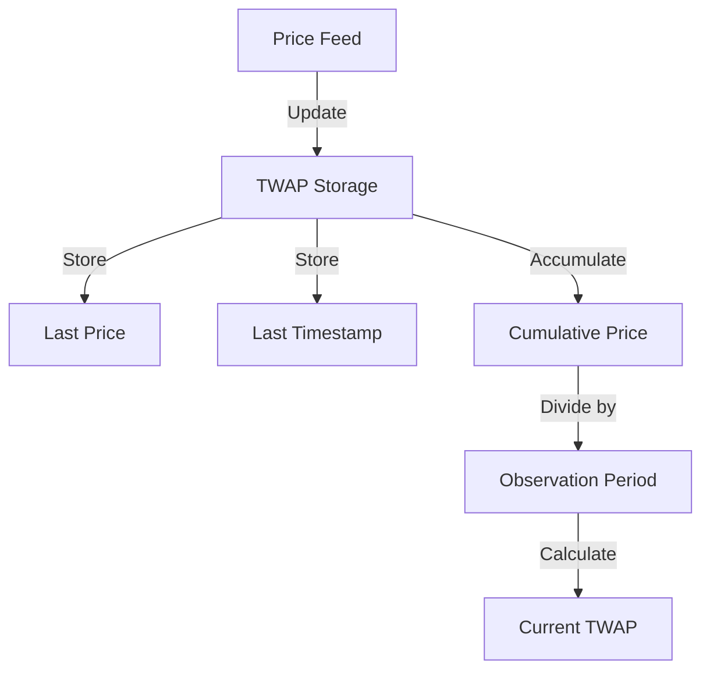
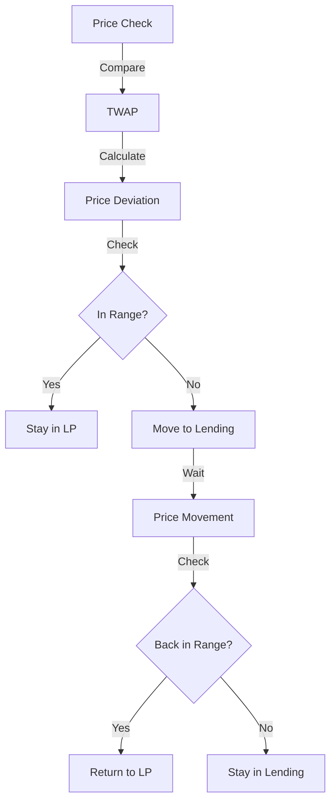
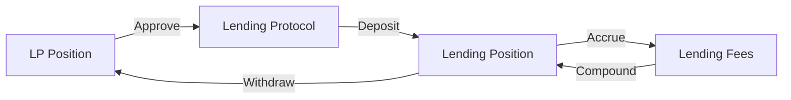
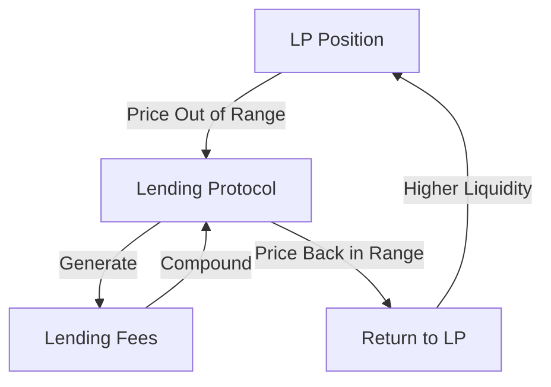

# Dynamic LP Hook Architecture

## Overview
The Dynamic LP Hook is a smart contract that enhances Uniswap V4 liquidity provision by automatically reallocating inactive liquidity to lending protocols. This creates a positive feedback loop where idle liquidity generates additional yield through lending protocols while maintaining the ability to quickly return to LP positions when needed.

## Core Components

### 1. TWAP (Time-Weighted Average Price) System

The TWAP system maintains a rolling average of prices over a configurable observation period. This helps determine when liquidity should be moved between LP and lending positions.

### 2. Dynamic Reallocation System

The reallocation system:
- Monitors price movements relative to TWAP
- Moves liquidity to lending when price deviates beyond configured range
- Returns liquidity to LP when price moves back within range
- Implements minimum reallocation time to prevent thrashing

### 3. Lending Protocol Integration

The lending integration:
- Manages token approvals for lending protocols
- Handles deposits and withdrawals
- Tracks lending positions and fees
- Implements fee collection and compounding

## Positive Feedback Loop

The system creates a positive feedback loop where:
1. Idle liquidity generates lending fees
2. Fees compound in the lending protocol
3. When returning to LP, the position is larger
4. Larger positions generate more fees
5. Cycle continues

## Key Parameters

- **Observation Period**: Time window for TWAP calculation (e.g., 1 hour)
- **Price Range**: Acceptable deviation from TWAP (in basis points)
- **Min Reallocation Time**: Minimum time between position changes
- **Lending Protocol**: Address of the integrated lending protocol

## Security Considerations

1. **Price Manipulation Protection**
   - TWAP provides resistance to short-term price manipulation
   - Minimum reallocation time prevents rapid position changes

2. **Lending Protocol Risks**
   - Protocol-specific risk management
   - Emergency withdrawal capabilities
   - Fee collection safeguards

3. **Access Control**
   - Initialization parameters
   - Admin functions
   - Emergency controls

## Gas Optimization

1. **Storage Optimization**
   - Efficient storage layout
   - Minimal state changes
   - Batch operations where possible

2. **Computation Optimization**
   - Efficient TWAP calculations
   - Optimized price range checks
   - Minimal external calls

## Future Improvements

1. **Advanced Features**
   - Multiple lending protocol support
   - Dynamic fee optimization
   - Advanced position sizing

2. **Risk Management**
   - Dynamic range adjustment
   - Automated risk assessment
   - Emergency protocols

3. **Integration**
   - Additional DEX support
   - Cross-chain capabilities
   - Advanced analytics 